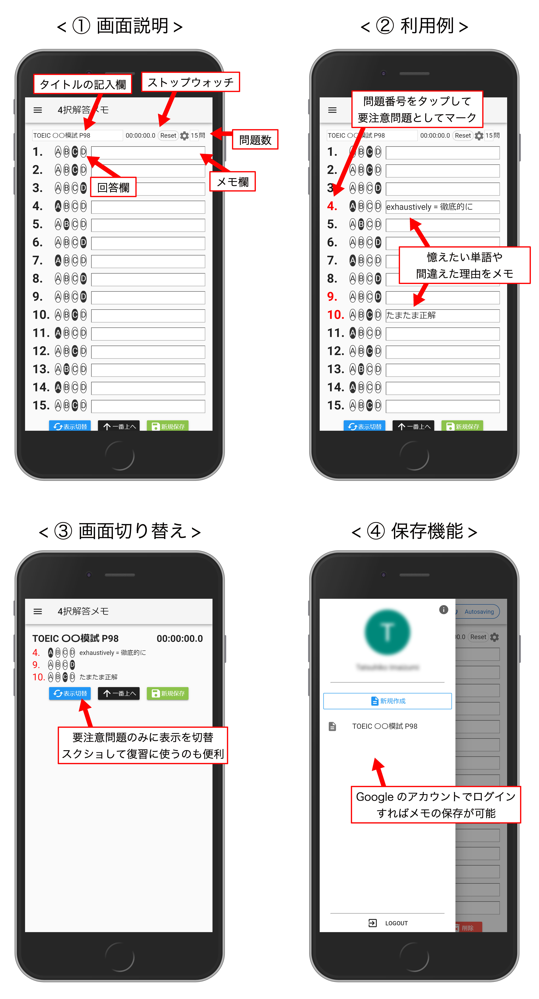

# nuxt-four-choices-question

## [4択解答メモ - GitHub Pages](https://izm51.github.io/four-choices-question-memo/)

**"4択解答メモ"** はTOEICなどの4択問題の解答と、各問のメモを記録するための簡易ツールです！

問題番号をタップすることで、要注意問題としてマークを付けることが出来ます。
"表示切替"を使用するとマークした問題とメモのある問題のみを表示して、復習に活用することが出来ます。
設定アイコンから設問数を変更できます。
一応ストップウォッチ機能がついています。

Googleのアカウントでログインすることで、ノートを自分のアカウントに保存し、一覧することが出来ます。
一度保存したノートは、変更があるたびにオートセーブされます。

リポジトリ：[Github](https://github.com/izm51/four-choices-question-memo)  
Blog：[Izm Log](https://izm51.com/)



## Build Setup

``` bash
# install dependencies
$ npm install

# serve with hot reload at localhost:3000
$ npm run dev

# build for production and launch server
$ npm run build
$ npm start

# generate static project
$ npm run generate
```

For detailed explanation on how things work, checkout [Nuxt.js docs](https://nuxtjs.org).
